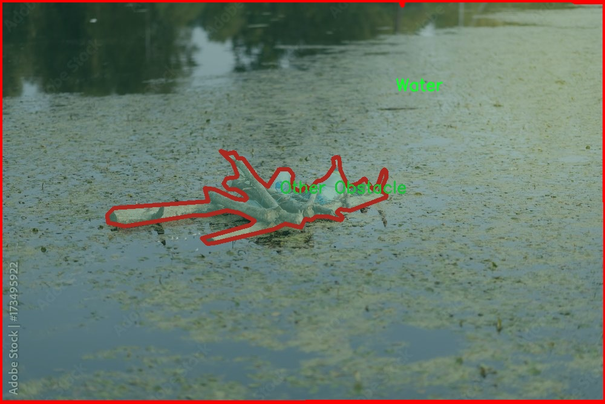

### 1.背景意义

研究背景与意义

随着全球水上交通的快速发展，海洋运输和水上活动的安全性与效率愈发受到重视。水上交通中涉及的多种物体，如商船、渔船、标志浮标以及其他障碍物，常常对航行安全构成威胁。因此，开发高效的物体检测与图像分割系统，能够实时识别和分类这些物体，成为了提升水上交通安全的重要手段。基于改进YOLOv11的海上场景水上交通物体检测图像分割系统，旨在利用深度学习技术，针对复杂的海洋环境，提供一种高效、准确的解决方案。

本研究所使用的数据集包含3600幅图像，涵盖了13个类别，包括商船、渔船、乘客船、标志浮标等。这些类别的多样性使得模型在训练过程中能够学习到丰富的特征，从而在实际应用中提高识别精度。尤其是在海上场景中，光照变化、波浪干扰以及背景复杂性等因素，都会对物体检测造成挑战。因此，改进YOLOv11模型的设计与训练，将为提升系统的鲁棒性和准确性提供可能。

此外，图像分割技术的引入，使得系统不仅能够识别物体的类别，还能精确地定位物体的边界。这对于后续的水上交通管理、事故预警以及自动驾驶等应用具有重要意义。通过对水上交通环境的深入分析与研究，本项目将为智能水上交通系统的建设提供理论支持和技术保障，推动海洋安全管理的智能化进程。总之，本研究不仅具有重要的学术价值，还有助于提升实际应用中的水上交通安全与效率，具有广泛的社会意义。

### 2.视频效果

[2.1 视频效果](https://www.bilibili.com/video/BV1HqkgY2EiC/)

### 3.图片效果


##### [项目涉及的源码数据来源链接](https://kdocs.cn/l/cszuIiCKVNis)**

注意：本项目提供训练的数据集和训练教程,由于版本持续更新,暂不提供权重文件（best.pt）,请按照6.训练教程进行训练后实现上图演示的效果。

### 4.数据集信息

##### 4.1 本项目数据集类别数＆类别名

nc: 13
names: ['Buoy-Marker', 'Commercial Vessel', 'Fishing Boat', 'Land', 'Other Obstacle', 'POV Vessel', 'Passenger Vessel', 'Person', 'Powerboat', 'Sailboat', 'Sky', 'Small Craft', 'Water']


该项目为【图像分割】数据集，请在【训练教程和Web端加载模型教程（第三步）】这一步的时候按照【图像分割】部分的教程来训练

##### 4.2 本项目数据集信息介绍

本项目数据集信息介绍

本项目所使用的数据集名为“Prototype-Dataset-May”，旨在为改进YOLOv11的海上场景水上交通物体检测图像分割系统提供丰富的训练数据。该数据集涵盖了13个类别，具体包括：Buoy-Marker（浮标标记）、Commercial Vessel（商船）、Fishing Boat（渔船）、Land（陆地）、Other Obstacle（其他障碍物）、POV Vessel（视角船只）、Passenger Vessel（客船）、Person（人）、Powerboat（动力艇）、Sailboat（帆船）、Sky（天空）、Small Craft（小型船只）以及Water（水面）。这些类别的多样性确保了模型在不同海上场景中的适应性和准确性。

数据集中的图像均为高分辨率，涵盖了多种天气和光照条件下的海上环境，确保了训练数据的多样性和真实性。每个类别的样本数量经过精心设计，以确保模型在训练过程中能够充分学习到每种物体的特征。此外，数据集还包含了标注信息，提供了每个物体在图像中的精确位置和形状，这对于图像分割任务至关重要。

通过使用“Prototype-Dataset-May”数据集，研究团队能够有效地训练和优化YOLOv11模型，使其在海上交通物体检测中表现出色。该数据集不仅为模型提供了必要的训练基础，还为后续的测试和验证阶段奠定了坚实的基础。随着模型的不断改进，期望能够在实际应用中实现更高的检测精度和更快的响应速度，从而提升海上交通安全和管理效率。





### 5.全套项目环境部署视频教程（零基础手把手教学）

[5.1 所需软件PyCharm和Anaconda安装教程（第一步）](https://www.bilibili.com/video/BV1BoC1YCEKi/?spm_id_from=333.999.0.0&vd_source=bc9aec86d164b67a7004b996143742dc)


[5.2 安装Python虚拟环境创建和依赖库安装视频教程（第二步）](https://www.bilibili.com/video/BV1ZoC1YCEBw?spm_id_from=333.788.videopod.sections&vd_source=bc9aec86d164b67a7004b996143742dc)

### 6.改进YOLOv11训练教程和Web_UI前端加载模型教程（零基础手把手教学）

[6.1 改进YOLOv11训练教程和Web_UI前端加载模型教程（第三步）](https://www.bilibili.com/video/BV1BoC1YCEhR?spm_id_from=333.788.videopod.sections&vd_source=bc9aec86d164b67a7004b996143742dc)


按照上面的训练视频教程链接加载项目提供的数据集，运行train.py即可开始训练



     Epoch   gpu_mem       box       obj       cls    labels  img_size
     1/200     20.8G   0.01576   0.01955  0.007536        22      1280: 100%|██████████| 849/849 [14:42<00:00,  1.04s/it]
               Class     Images     Labels          P          R     mAP@.5 mAP@.5:.95: 100%|██████████| 213/213 [01:14<00:00,  2.87it/s]
                 all       3395      17314      0.994      0.957      0.0957      0.0843

     Epoch   gpu_mem       box       obj       cls    labels  img_size
     2/200     20.8G   0.01578   0.01923  0.007006        22      1280: 100%|██████████| 849/849 [14:44<00:00,  1.04s/it]
               Class     Images     Labels          P          R     mAP@.5 mAP@.5:.95: 100%|██████████| 213/213 [01:12<00:00,  2.95it/s]
                 all       3395      17314      0.996      0.956      0.0957      0.0845

     Epoch   gpu_mem       box       obj       cls    labels  img_size
     3/200     20.8G   0.01561    0.0191  0.006895        27      1280: 100%|██████████| 849/849 [10:56<00:00,  1.29it/s]
               Class     Images     Labels          P          R     mAP@.5 mAP@.5:.95: 100%|███████   | 187/213 [00:52<00:00,  4.04it/s]
                 all       3395      17314      0.996      0.957      0.0957      0.0845


###### [项目数据集下载链接](https://kdocs.cn/l/cszuIiCKVNis)

### 7.原始YOLOv11算法讲解

##### YOLO11简介

> YOLO11源码地址：https://github.com/ultralytics/ultralytics

Ultralytics
YOLO11是一款尖端的、最先进的模型，它在之前YOLO版本成功的基础上进行了构建，并引入了新功能和改进，以进一步提升性能和灵活性。YOLO11设计快速、准确且易于使用，使其成为各种物体检测和跟踪、实例分割、图像分类以及姿态估计任务的绝佳选择。  


**YOLO11创新点如下:**

YOLO 11主要改进包括：  
`增强的特征提取`：YOLO 11采用了改进的骨干和颈部架构，增强了特征提取功能，以实现更精确的目标检测。  
`优化的效率和速度`：优化的架构设计和优化的训练管道提供更快的处理速度，同时保持准确性和性能之间的平衡。  
`更高的精度，更少的参数`：YOLO11m在COCO数据集上实现了更高的平均精度（mAP），参数比YOLOv8m少22%，使其在不影响精度的情况下提高了计算效率。  
`跨环境的适应性`：YOLO 11可以部署在各种环境中，包括边缘设备、云平台和支持NVIDIA GPU的系统。  
`广泛的支持任务`：YOLO 11支持各种计算机视觉任务，如对象检测、实例分割、图像分类、姿态估计和面向对象检测（OBB）。

**YOLO11不同模型尺寸信息：**

YOLO11 提供5种不同的型号规模模型，以满足不同的应用需求：

Model| size (pixels)| mAPval 50-95| Speed CPU ONNX (ms)| Speed T4 TensorRT10
(ms)| params (M)| FLOPs (B)  
---|---|---|---|---|---|---  
YOLO11n| 640| 39.5| 56.1 ± 0.8| 1.5 ± 0.0| 2.6| 6.5  
YOLO11s| 640| 47.0| 90.0 ± 1.2| 2.5 ± 0.0| 9.4| 21.5  
YOLO11m| 640| 51.5| 183.2 ± 2.0| 4.7 ± 0.1| 20.1| 68.0  
YOLO11l| 640| 53.4| 238.6 ± 1.4| 6.2 ± 0.1| 25.3| 86.9  
YOLO11x| 640| 54.7| 462.8 ± 6.7| 11.3 ± 0.2| 56.9| 194.9  
  
**模型常用训练超参数参数说明：**  
`YOLOv11
模型的训练设置包括训练过程中使用的各种超参数和配置`。这些设置会影响模型的性能、速度和准确性。关键的训练设置包括批量大小、学习率、动量和权重衰减。此外，优化器、损失函数和训练数据集组成的选择也会影响训练过程。对这些设置进行仔细的调整和实验对于优化性能至关重要。  
**以下是一些常用的模型训练参数和说明：**

参数名| 默认值| 说明  
---|---|---  
`model`| `None`| 指定用于训练的模型文件。接受指向 `.pt` 预训练模型或 `.yaml`
配置文件。对于定义模型结构或初始化权重至关重要。  
`data`| `None`| 数据集配置文件的路径（例如
`coco8.yaml`).该文件包含特定于数据集的参数，包括训练数据和验证数据的路径、类名和类数。  
`epochs`| `100`| 训练总轮数。每个epoch代表对整个数据集进行一次完整的训练。调整该值会影响训练时间和模型性能。  
`patience`| `100`| 在验证指标没有改善的情况下，提前停止训练所需的epoch数。当性能趋于平稳时停止训练，有助于防止过度拟合。  
`batch`| `16`| 批量大小，有三种模式:设置为整数(例如，’ Batch =16 ‘)， 60% GPU内存利用率的自动模式(’ Batch
=-1 ‘)，或指定利用率分数的自动模式(’ Batch =0.70 ')。  
`imgsz`| `640`| 用于训练的目标图像尺寸。所有图像在输入模型前都会被调整到这一尺寸。影响模型精度和计算复杂度。  
`device`| `None`| 指定用于训练的计算设备：单个 GPU (`device=0`）、多个 GPU (`device=0,1`)、CPU
(`device=cpu`)，或苹果芯片的 MPS (`device=mps`).  
`workers`| `8`| 加载数据的工作线程数（每 `RANK` 多 GPU 训练）。影响数据预处理和输入模型的速度，尤其适用于多 GPU 设置。  
`name`| `None`| 训练运行的名称。用于在项目文件夹内创建一个子目录，用于存储训练日志和输出结果。  
`pretrained`| `True`| 决定是否从预处理模型开始训练。可以是布尔值，也可以是加载权重的特定模型的字符串路径。提高训练效率和模型性能。  
`optimizer`| `'auto'`| 为训练模型选择优化器。选项包括 `SGD`, `Adam`, `AdamW`, `NAdam`,
`RAdam`, `RMSProp` 等，或 `auto` 用于根据模型配置进行自动选择。影响收敛速度和稳定性  
`lr0`| `0.01`| 初始学习率（即 `SGD=1E-2`, `Adam=1E-3`) .调整这个值对优化过程至关重要，会影响模型权重的更新速度。  
`lrf`| `0.01`| 最终学习率占初始学习率的百分比 = (`lr0 * lrf`)，与调度程序结合使用，随着时间的推移调整学习率。  


**各损失函数作用说明：**  
`定位损失box_loss`：预测框与标定框之间的误差（GIoU），越小定位得越准；  
`分类损失cls_loss`：计算锚框与对应的标定分类是否正确，越小分类得越准；  
`动态特征损失（dfl_loss）`：DFLLoss是一种用于回归预测框与目标框之间距离的损失函数。在计算损失时，目标框需要缩放到特征图尺度，即除以相应的stride，并与预测的边界框计算Ciou
Loss，同时与预测的anchors中心点到各边的距离计算回归DFLLoss。  


### 8.200+种全套改进YOLOV11创新点原理讲解

#### 8.1 200+种全套改进YOLOV11创新点原理讲解大全

由于篇幅限制，每个创新点的具体原理讲解就不全部展开，具体见下列网址中的改进模块对应项目的技术原理博客网址【Blog】（创新点均为模块化搭建，原理适配YOLOv5~YOLOv11等各种版本）

[改进模块技术原理博客【Blog】网址链接](https://gitee.com/qunmasj/good)


#### 8.2 精选部分改进YOLOV11创新点原理讲解

###### 这里节选部分改进创新点展开原理讲解(完整的改进原理见上图和[改进模块技术原理博客链接](https://gitee.com/qunmasj/good)【如果此小节的图加载失败可以通过CSDN或者Github搜索该博客的标题访问原始博客，原始博客图片显示正常】

### AutoFocus: Efficient Multi-Scale Conv简介

参考该博客提出了AutoFocus，一种高效的多尺度目标检测算法。相较于以前对整个图像金字塔进行处理，该方法以一种由表及里的姿态，仅处理哪些整体上看来很有可能存在小物体的区域。这个可以通过预测一张类别未知的分割图FocusPixels来得到。为了高效利用FocusPixels，另外一个算法用于产生包含FocusPixels的FocusChips，这样可以减少计算量并处理更更精细的尺度。在不同尺度上FocusChips所得到的检测结果综合时，会出现问题，我们也提供了解决问题的方案。AutoFocus在COCO上的结果有49.7%mAP（50%重叠下68.3%），与多尺度baseline相仿但是快了2.5倍。金字塔中处理的像素数量减少了5倍mAP只下降1%，在与RetinaNet采用相同的ResNet-101结构且速度相同时，高了10%mAP。

人类寻找物体是一个动态的过程，且寻找时间与场景的复杂度是直接相关的。当我们的眼神在不同的点之间漂移时，其他的区域会被我们有意忽视。然而，现在的检测算法是一种静态的推理过程且图像金字塔中的每个像素都受到了一样的对待，这使得过程变得没有效率。现在许多的应用都不强调实时性，而计算上的节省其实可以产生很大收益。

在COCO数据集中，虽然40%的物体都是小物体，但是它们一共只占了全图的0.3%。如果金字塔是3倍关系，则在高分辨率层要进行9倍的运算。XXX 。那么有没有办法在低分辨率下找出可能含有这些物体的区域呢？

以人眼方案类比，我们可以从低分辨率图像开始，找出有可能存在物体的区域再“聚集”到高分辨率。我们的AutoFocus会在一层中计算小物体的分割图FocusPixels，而在每一个FocusPixels上会用一个算法产生下一层所需要关注的chips。在COCO的最大分辨率层上我们可以只处理**20%的像素而性能不下降，如果只处理5%**也只下降1%而已。


图像金字塔与卷积神经网络对CV十分重要。然而卷积神经网络无法做到对尺度不敏感，所以为了不同大小的物体需要依赖图像金字塔。虽然训练已经有了高效的方法，但是其推断时间依然远离实际使用标准。

目标检测加速有很长历史了。常用的有特征近似以减少尺度、级联、特征金字塔，且最后一个最近很多人研究。

AutoFocus为速度与精度之间提供了一个平滑的折衷，指出可以在低分辨率下看出小物体的所在，从而节约计算。FocusPixels的计算较为容易。

先简单介绍一下SNIP，是一种多尺度的训练、推断算法。主要思想是训练针对某个特定scale的检测器而不是scale-invariant检测器。这样训练样本就局限于在某个尺度范围内，以适于这个检测器处理。比如在高分辨率仅处理小物体而高分辨率仅处理大物体，其优势在于训练时不用考虑尺度的变化。

由于训练时物体大小是已知的，我们在图像金字塔中可以忽略大量区域而只处理物体周围的区域。SNIPER说明这样低分辨率的训练与全图训练相比并不会降低性能。同样，在推断过程中如果可以在大分辨率图像上预测可能出现小物体的chip，我们也就不用处理整张高分辨率图片。在训练时，许多物体会被裁剪、扭曲，这可以当作是一种数据扩增，然而当这个情况在推断时出现，则会产生错误，所以我们还需要一个算法来整合不同尺度上的检测结果。

#### AutoFocus框架
如SIFT、SURF等传统分类特征包含两个组件，一个detector和一个descriptor。detector只包含轻量级的操作如DoG、LoG，用于在整张图片上找到感兴趣的区域；descriptor，一般来说计算量比较大，则只需要关注那些咸兴趣的区域。这个级联结构保障了图片处理的效率。

同样，AutoFocus框架也是用于预测感兴趣的区域，并丢弃在下一尺度不可能存在物体的区域，并将裁剪和缩放后的区域传递给下一尺度。AutoFocus由三个部分组成：FocusPixels，FocusChips和focus stacking。

#### FocusPixels
FocusPixels定义在卷积网络特征图的粒度之上（如conv5），如果特征图上某个像素与小物体有重叠则标注为一个FocusPixel。（小物体：面积处于一个网络的输入范围之内）。训练过程中，FocusPixels标注为正，某些与不在面积范围内的物体有重叠的像素标注为无效，其他像素标注为负。AutoFocus的训练目标是使在FocusPixels区域产生较大的激活值。

如果同时多个物体与同一像素重叠，优先给正标注。我们的网络输入是512x512，然后a,b,c取值分别是5,64,90。对于太大或太小的物体，我们认为当前尺度上没有足够人信息进行判断，所以会标定为无效。整个网络结构如下图。训练时加两层带ReLU的卷积(3x3和1x1)以及一个二分类softmax来预测FocusPixels。


#### FocusChip生成
推断过程中，我们标注输出概率大于阈值t的像素（这个参数可以控制加速比），得到一些连通域。对于每一个域，我们做一次膨胀使其包含一些有助于识别的周围信息，膨胀后相连的部分要合并。然后，我们生成一些包含连通域的chips（不同chips可能重叠，如有重叠则合并）。有些chip可能太小缺少必要信息，并使chip的大小变化很大，为了效率我们要求保证一个最小的chip size。算法流程如下：


#### 级联推断过程
我们的过程类似于图片金字塔的推断过程但是在过程中一步步去除不关注的图片区域。我们在最低分辨率上进行检测并生成chips，然后在这些chips再进行检测和生成chips。

#### Focus Stacking
这种级联分类器的一个问题是在chip边缘本来的大物体可能生成一些被剪裁的检测目标。在下一个尺度上，由于剪裁过了，所以会检测到小的、错误的正例False Positive。之前算法中的第二步膨胀其实就是为了保证没有物体会出现在chip的边缘。这样，当我们在局部图片chip的边缘检测到物体时，就可以把这个检测结果丢弃，即使其在SNIP的范围内。

也有一些物体在图片边缘的特殊情况。如果chip和图片共享一条边的话，我们会检查检测结果的其他边是否完全在里面，如果在，则保留它，否则丢弃。

在每一尺度得到有效检测结果后，我们可以将不同尺度上的结果进行整合，将这些结果映射到原图坐标系上。最后，非极大值抑制NMS用于聚集。网络结构如之前的图片所示。


### 9.系统功能展示

图9.1.系统支持检测结果表格显示

  图9.2.系统支持置信度和IOU阈值手动调节

  图9.3.系统支持自定义加载权重文件best.pt(需要你通过步骤5中训练获得)

  图9.4.系统支持摄像头实时识别

  图9.5.系统支持图片识别

  图9.6.系统支持视频识别

  图9.7.系统支持识别结果文件自动保存

  图9.8.系统支持Excel导出检测结果数据


### 10. YOLOv11核心改进源码讲解

#### 10.1 wtconv2d.py

以下是经过简化和注释的核心代码，保留了小波变换（Wavelet Transform）和卷积操作的主要部分：

```python
import torch
import torch.nn as nn
import torch.nn.functional as F
import pywt

# 创建小波滤波器
def create_wavelet_filter(wave, in_size, out_size, type=torch.float):
    # 使用PyWavelets库创建小波对象
    w = pywt.Wavelet(wave)
    
    # 反转小波的分解高通和低通滤波器
    dec_hi = torch.tensor(w.dec_hi[::-1], dtype=type)
    dec_lo = torch.tensor(w.dec_lo[::-1], dtype=type)
    
    # 创建分解滤波器
    dec_filters = torch.stack([
        dec_lo.unsqueeze(0) * dec_lo.unsqueeze(1),
        dec_lo.unsqueeze(0) * dec_hi.unsqueeze(1),
        dec_hi.unsqueeze(0) * dec_lo.unsqueeze(1),
        dec_hi.unsqueeze(0) * dec_hi.unsqueeze(1)
    ], dim=0)

    # 重复滤波器以匹配输入通道数
    dec_filters = dec_filters[:, None].repeat(in_size, 1, 1, 1)

    # 反转重构滤波器
    rec_hi = torch.tensor(w.rec_hi[::-1], dtype=type).flip(dims=[0])
    rec_lo = torch.tensor(w.rec_lo[::-1], dtype=type).flip(dims=[0])
    
    # 创建重构滤波器
    rec_filters = torch.stack([
        rec_lo.unsqueeze(0) * rec_lo.unsqueeze(1),
        rec_lo.unsqueeze(0) * rec_hi.unsqueeze(1),
        rec_hi.unsqueeze(0) * rec_lo.unsqueeze(1),
        rec_hi.unsqueeze(0) * rec_hi.unsqueeze(1)
    ], dim=0)

    # 重复滤波器以匹配输出通道数
    rec_filters = rec_filters[:, None].repeat(out_size, 1, 1, 1)

    return dec_filters, rec_filters

# 小波变换
def wavelet_transform(x, filters):
    b, c, h, w = x.shape  # 获取输入的批次大小、通道数、高度和宽度
    pad = (filters.shape[2] // 2 - 1, filters.shape[3] // 2 - 1)  # 计算填充
    # 使用小波滤波器进行卷积，stride=2表示下采样
    x = F.conv2d(x, filters.to(x.dtype).to(x.device), stride=2, groups=c, padding=pad)
    x = x.reshape(b, c, 4, h // 2, w // 2)  # 重塑输出形状
    return x

# 反小波变换
def inverse_wavelet_transform(x, filters):
    b, c, _, h_half, w_half = x.shape  # 获取输入的形状
    pad = (filters.shape[2] // 2 - 1, filters.shape[3] // 2 - 1)  # 计算填充
    x = x.reshape(b, c * 4, h_half, w_half)  # 重塑输入形状
    # 使用小波滤波器进行转置卷积，stride=2表示上采样
    x = F.conv_transpose2d(x, filters.to(x.dtype).to(x.device), stride=2, groups=c, padding=pad)
    return x

# 定义小波变换类
class WaveletTransform(Function):
    @staticmethod
    def forward(ctx, input, filters):
        ctx.filters = filters  # 保存滤波器
        with torch.no_grad():
            x = wavelet_transform(input, filters)  # 执行小波变换
        return x

    @staticmethod
    def backward(ctx, grad_output):
        grad = inverse_wavelet_transform(grad_output, ctx.filters)  # 计算梯度
        return grad, None

# 定义小波卷积层
class WTConv2d(nn.Module):
    def __init__(self, in_channels, out_channels, kernel_size=5, stride=1, bias=True, wt_levels=1, wt_type='db1'):
        super(WTConv2d, self).__init__()

        assert in_channels == out_channels  # 输入通道数和输出通道数必须相等

        self.in_channels = in_channels
        self.wt_levels = wt_levels
        self.stride = stride

        # 创建小波滤波器
        self.wt_filter, self.iwt_filter = create_wavelet_filter(wt_type, in_channels, in_channels, torch.float)
        self.wt_filter = nn.Parameter(self.wt_filter, requires_grad=False)
        self.iwt_filter = nn.Parameter(self.iwt_filter, requires_grad=False)

        # 定义基础卷积层
        self.base_conv = nn.Conv2d(in_channels, in_channels, kernel_size, padding='same', stride=1, groups=in_channels, bias=bias)

    def forward(self, x):
        # 执行小波变换和卷积操作
        x_tag = wavelet_transform(x, self.wt_filter)  # 小波变换
        x = self.base_conv(x)  # 基础卷积
        x = x + x_tag  # 合并卷积结果和小波变换结果
        return x
```

### 代码注释说明：
1. **创建小波滤波器**：使用PyWavelets库生成小波的分解和重构滤波器，并将其转换为PyTorch张量。
2. **小波变换和反小波变换**：定义了两个函数，分别用于执行小波变换和反小波变换，利用卷积和转置卷积实现。
3. **WaveletTransform类**：实现了小波变换的前向和反向传播，便于在神经网络中使用。
4. **WTConv2d类**：定义了一个小波卷积层，包含基础卷积和小波变换的结合。

这个文件 `wtconv2d.py` 实现了一个基于小波变换的二维卷积层，主要用于图像处理和特征提取。文件中使用了 PyTorch 框架，并结合了小波变换的数学原理来构建一个新的卷积层 `WTConv2d`。

首先，文件导入了必要的库，包括 PyTorch 的核心模块、神经网络模块、功能模块，以及用于小波变换的 `pywt` 库。接着，定义了一个函数 `create_wavelet_filter`，该函数根据给定的小波类型和输入输出通道的数量，创建小波变换和逆小波变换所需的滤波器。这个函数生成了两个滤波器：一个用于小波变换（降采样），另一个用于逆小波变换（升采样）。

接下来，定义了两个函数 `wavelet_transform` 和 `inverse_wavelet_transform`，分别用于执行小波变换和逆小波变换。它们通过使用 PyTorch 的卷积操作实现，支持多通道输入，并且在变换过程中考虑了适当的填充。

然后，定义了两个类 `WaveletTransform` 和 `InverseWaveletTransform`，它们继承自 `torch.autograd.Function`。这两个类分别实现了小波变换和逆小波变换的前向和反向传播方法，以便在训练过程中能够计算梯度。

接下来，定义了两个初始化函数 `wavelet_transform_init` 和 `inverse_wavelet_transform_init`，用于生成小波变换和逆小波变换的应用函数。

`WTConv2d` 类是这个文件的核心部分，继承自 `nn.Module`。在初始化方法中，首先验证输入和输出通道数相同。然后，创建小波变换和逆小波变换的滤波器，并将其设置为不可训练的参数。接着，定义了基本的卷积层和小波卷积层，后者用于处理小波变换后的特征。

在 `forward` 方法中，输入数据首先经过小波变换，得到低频和高频特征。然后，逐层处理这些特征，使用小波卷积层进行特征提取。最后，进行逆小波变换，将处理后的特征合并回去，并与基本卷积层的输出相加，形成最终的输出。

最后，定义了一个辅助类 `_ScaleModule`，用于对输入进行缩放操作，便于在网络中调整特征的尺度。

整体而言，这个文件实现了一个结合小波变换的卷积神经网络层，能够有效地提取图像特征，同时保留了小波变换的多分辨率特性，适用于图像处理和计算机视觉任务。

#### 10.2 mamba_vss.py

以下是经过简化和注释的核心代码部分：

```python
import torch
import torch.nn as nn
import torch.nn.functional as F

class SS2D(nn.Module):
    def __init__(self, d_model, d_state=16, d_conv=3, expand=2, dropout=0.):
        super().__init__()
        self.d_model = d_model  # 输入特征维度
        self.d_state = d_state  # 状态维度
        self.d_conv = d_conv  # 卷积核大小
        self.expand = expand  # 扩展因子
        self.d_inner = int(self.expand * self.d_model)  # 内部特征维度

        # 输入投影层，将输入特征维度映射到内部特征维度
        self.in_proj = nn.Linear(self.d_model, self.d_inner * 2)
        # 卷积层，进行特征提取
        self.conv2d = nn.Conv2d(in_channels=self.d_inner, out_channels=self.d_inner, groups=self.d_inner, kernel_size=d_conv, padding=(d_conv - 1) // 2)
        self.act = nn.SiLU()  # 激活函数

        # 输出层，最终将内部特征映射回输入特征维度
        self.out_proj = nn.Linear(self.d_inner, self.d_model)
        self.dropout = nn.Dropout(dropout) if dropout > 0. else None  # 可选的dropout层

    def forward(self, x: torch.Tensor):
        # 输入 x 的形状为 (B, H, W, C)，需要调整为 (B, C, H, W)
        x = x.permute(0, 3, 1, 2).contiguous()  # 变换维度顺序
        x = self.in_proj(x)  # 输入投影
        x, z = x.chunk(2, dim=-1)  # 将投影结果分为两个部分

        x = self.act(self.conv2d(x))  # 经过卷积和激活函数
        y = self.forward_core(x)  # 通过核心前向传播
        y = y * F.silu(z)  # 结合 z 的信息
        out = self.out_proj(y)  # 输出层映射回原始维度
        if self.dropout is not None:
            out = self.dropout(out)  # 应用dropout
        return out

    def forward_core(self, x: torch.Tensor):
        # 核心前向传播逻辑
        B, C, H, W = x.shape
        L = H * W  # 计算总的空间维度
        K = 4  # 定义 K 的值

        # 处理输入，准备进行选择性扫描
        x_hwwh = torch.stack([x.view(B, -1, L), torch.transpose(x, dim0=2, dim1=3).contiguous().view(B, -1, L)], dim=1).view(B, 2, -1, L)
        xs = torch.cat([x_hwwh, torch.flip(x_hwwh, dims=[-1])], dim=1)  # 生成对称输入

        # 进行选择性扫描的计算
        # 省略具体实现细节，假设有一个选择性扫描函数
        out_y = self.selective_scan(xs)  # 调用选择性扫描函数

        # 处理输出
        y = out_y.view(B, H, W, -1)  # 变换输出维度
        return y

class VSSBlock(nn.Module):
    def __init__(self, hidden_dim: int = 0, drop_path: float = 0.2):
        super().__init__()
        self.ln_1 = nn.LayerNorm(hidden_dim)  # 归一化层
        self.self_attention = SS2D(d_model=hidden_dim)  # 自注意力层
        self.drop_path = nn.Dropout(drop_path)  # 随机丢弃路径

    def forward(self, input: torch.Tensor):
        input = input.permute((0, 2, 3, 1))  # 调整输入维度
        x = input + self.drop_path(self.self_attention(self.ln_1(input)))  # 残差连接
        return x.permute((0, 3, 1, 2))  # 恢复维度顺序

# 示例代码，用于测试模型
if __name__ == '__main__':
    inputs = torch.randn((1, 64, 32, 32)).cuda()  # 生成随机输入
    model = VSSBlock(64).cuda()  # 实例化模型
    pred = model(inputs)  # 前向传播
    print(pred.size())  # 输出预测结果的尺寸
```

### 代码说明：
1. **SS2D类**：实现了一个自注意力机制，包含输入投影、卷积层和输出投影。核心前向传播逻辑在`forward_core`方法中实现。
2. **VSSBlock类**：包含一个归一化层和一个自注意力层，使用残差连接来增强模型的学习能力。
3. **前向传播**：通过`forward`方法实现，输入数据的维度需要调整以适应模型的要求。
4. **示例代码**：用于测试模型的输入和输出尺寸。

这个程序文件 `mamba_vss.py` 实现了两个神经网络模块：`VSSBlock` 和 `Mamba2Block`，它们都基于自定义的 `SS2D` 类。该文件使用了 PyTorch 库，主要用于构建深度学习模型，特别是在处理图像数据时。

首先，文件导入了一些必要的库，包括 PyTorch 的核心库、神经网络模块、功能性操作、以及用于处理张量的 `einops` 库。还尝试导入了一些自定义的模块和函数，如果这些模块不存在则会被忽略。

`SS2D` 类是实现的核心部分，它继承自 `nn.Module`。在初始化方法中，定义了一系列参数，包括模型的维度、状态维度、卷积核大小、扩展因子等。接着，创建了一些线性层和卷积层，使用了 SiLU 激活函数，并定义了一些参数的初始化方法。特别地，`dt_init`、`A_log_init` 和 `D_init` 方法用于初始化不同的权重和偏置，以确保模型在训练开始时的稳定性。

`forward_corev0` 方法是 `SS2D` 类的核心前向传播逻辑，处理输入张量并进行一系列的线性变换、卷积操作和选择性扫描。这个方法的输出经过一系列的变换后，返回最终的结果。

`forward` 方法则是 `SS2D` 类的前向传播接口，接收输入数据，经过线性投影、卷积、核心前向传播以及最终的输出投影，返回模型的输出。

`VSSBlock` 类同样继承自 `nn.Module`，并在初始化时创建了一个层归一化层和一个 `SS2D` 自注意力层。它的前向传播方法对输入进行变换，并将自注意力的输出与原始输入相加，应用了 DropPath 技术以增强模型的鲁棒性。

`Mamba2Block` 类继承自 `VSSBlock`，并在初始化时替换了自注意力层为 `Mamba2Simple`，这是另一个自定义的模块。它的前向传播方法与 `VSSBlock` 类似，但在处理输入时进行了额外的维度变换。

在文件的最后部分，包含了一个测试代码块，用于创建随机输入并通过 `VSSBlock` 和 `Mamba2Block` 进行前向传播，打印输出的尺寸。这部分代码可以用于验证模型的基本功能和形状是否正确。

总体来说，这个文件实现了一个复杂的自注意力机制，适用于图像处理任务，具有灵活的参数设置和初始化方法，旨在提高模型的性能和稳定性。

#### 10.3 repvit.py

以下是代码中最核心的部分，并附上详细的中文注释：

```python
import torch.nn as nn
import torch

# 定义一个用于替换BatchNorm层的函数
def replace_batchnorm(net):
    for child_name, child in net.named_children():
        # 如果子模块有fuse_self方法，进行融合
        if hasattr(child, 'fuse_self'):
            fused = child.fuse_self()
            setattr(net, child_name, fused)
            replace_batchnorm(fused)
        # 如果子模块是BatchNorm2d，替换为Identity层
        elif isinstance(child, torch.nn.BatchNorm2d):
            setattr(net, child_name, torch.nn.Identity())
        else:
            replace_batchnorm(child)

# 定义一个函数，用于确保通道数是可被8整除的
def _make_divisible(v, divisor, min_value=None):
    if min_value is None:
        min_value = divisor
    new_v = max(min_value, int(v + divisor / 2) // divisor * divisor)
    # 确保向下取整不会减少超过10%
    if new_v < 0.9 * v:
        new_v += divisor
    return new_v

# 定义一个包含卷积和BatchNorm的模块
class Conv2d_BN(torch.nn.Sequential):
    def __init__(self, a, b, ks=1, stride=1, pad=0, dilation=1, groups=1, bn_weight_init=1):
        super().__init__()
        # 添加卷积层
        self.add_module('c', torch.nn.Conv2d(a, b, ks, stride, pad, dilation, groups, bias=False))
        # 添加BatchNorm层
        self.add_module('bn', torch.nn.BatchNorm2d(b))
        # 初始化BatchNorm的权重
        torch.nn.init.constant_(self.bn.weight, bn_weight_init)
        torch.nn.init.constant_(self.bn.bias, 0)

    @torch.no_grad()
    def fuse_self(self):
        # 融合卷积层和BatchNorm层
        c, bn = self._modules.values()
        w = bn.weight / (bn.running_var + bn.eps)**0.5
        w = c.weight * w[:, None, None, None]
        b = bn.bias - bn.running_mean * bn.weight / (bn.running_var + bn.eps)**0.5
        m = torch.nn.Conv2d(w.size(1) * self.c.groups, w.size(0), w.shape[2:], stride=self.c.stride, padding=self.c.padding, dilation=self.c.dilation, groups=self.c.groups)
        m.weight.data.copy_(w)
        m.bias.data.copy_(b)
        return m

# 定义残差模块
class Residual(torch.nn.Module):
    def __init__(self, m, drop=0.):
        super().__init__()
        self.m = m  # 模块
        self.drop = drop  # 丢弃率

    def forward(self, x):
        # 在训练时根据丢弃率决定是否添加残差
        if self.training and self.drop > 0:
            return x + self.m(x) * torch.rand(x.size(0), 1, 1, 1, device=x.device).ge_(self.drop).div(1 - self.drop).detach()
        else:
            return x + self.m(x)

    @torch.no_grad()
    def fuse_self(self):
        # 融合残差模块
        if isinstance(self.m, Conv2d_BN):
            m = self.m.fuse_self()
            identity = torch.ones(m.weight.shape[0], m.weight.shape[1], 1, 1)
            identity = torch.nn.functional.pad(identity, [1, 1, 1, 1])
            m.weight += identity.to(m.weight.device)
            return m
        else:
            return self

# 定义RepViTBlock模块
class RepViTBlock(nn.Module):
    def __init__(self, inp, hidden_dim, oup, kernel_size, stride, use_se, use_hs):
        super(RepViTBlock, self).__init__()
        assert stride in [1, 2]
        self.identity = stride == 1 and inp == oup  # 判断是否为身份映射
        assert(hidden_dim == 2 * inp)  # 隐藏层维度为输入维度的两倍

        if stride == 2:
            # 如果步幅为2，构建token混合和通道混合
            self.token_mixer = nn.Sequential(
                Conv2d_BN(inp, inp, kernel_size, stride, (kernel_size - 1) // 2, groups=inp),
                SqueezeExcite(inp, 0.25) if use_se else nn.Identity(),
                Conv2d_BN(inp, oup, ks=1, stride=1, pad=0)
            )
            self.channel_mixer = Residual(nn.Sequential(
                Conv2d_BN(oup, 2 * oup, 1, 1, 0),
                nn.GELU() if use_hs else nn.GELU(),
                Conv2d_BN(2 * oup, oup, 1, 1, 0, bn_weight_init=0),
            ))
        else:
            assert(self.identity)
            self.token_mixer = nn.Sequential(
                RepVGGDW(inp),
                SqueezeExcite(inp, 0.25) if use_se else nn.Identity(),
            )
            self.channel_mixer = Residual(nn.Sequential(
                Conv2d_BN(inp, hidden_dim, 1, 1, 0),
                nn.GELU() if use_hs else nn.GELU(),
                Conv2d_BN(hidden_dim, oup, 1, 1, 0, bn_weight_init=0),
            ))

    def forward(self, x):
        return self.channel_mixer(self.token_mixer(x))

# 定义RepViT模型
class RepViT(nn.Module):
    def __init__(self, cfgs):
        super(RepViT, self).__init__()
        self.cfgs = cfgs  # 配置参数
        input_channel = self.cfgs[0][2]  # 输入通道数
        # 构建第一个层
        patch_embed = torch.nn.Sequential(Conv2d_BN(3, input_channel // 2, 3, 2, 1), torch.nn.GELU(),
                                           Conv2d_BN(input_channel // 2, input_channel, 3, 2, 1))
        layers = [patch_embed]
        # 构建反向残差块
        block = RepViTBlock
        for k, t, c, use_se, use_hs, s in self.cfgs:
            output_channel = _make_divisible(c, 8)
            exp_size = _make_divisible(input_channel * t, 8)
            layers.append(block(input_channel, exp_size, output_channel, k, s, use_se, use_hs))
            input_channel = output_channel
        self.features = nn.ModuleList(layers)

    def forward(self, x):
        for f in self.features:
            x = f(x)
        return x

# 示例：构建RepViT模型
if __name__ == '__main__':
    cfgs = [
        # k, t, c, SE, HS, s 
        [3, 2, 64, 1, 0, 1],
        [3, 2, 64, 0, 0, 1],
        # 更多配置...
    ]
    model = RepViT(cfgs)  # 创建模型实例
    inputs = torch.randn((1, 3, 640, 640))  # 创建输入张量
    res = model(inputs)  # 前向传播
    print(res.size())  # 输出结果的尺寸
```

### 代码核心部分解释：
1. **BatchNorm替换**：`replace_batchnorm`函数用于将模型中的BatchNorm层替换为Identity层，以便在推理时加速计算。
2. **可被8整除的通道数**：`_make_divisible`函数确保网络中所有层的通道数都是8的倍数，以符合特定的硬件要求。
3. **卷积和BatchNorm组合**：`Conv2d_BN`类封装了卷积层和BatchNorm层，并提供了融合的方法。
4. **残差连接**：`Residual`类实现了残差连接的逻辑，允许在训练时使用随机丢弃。
5. **RepViTBlock**：这是RepViT模型的基本构建块，负责处理输入特征的混合和通道的转换。
6. **RepViT模型**：`RepViT`类构建了整个模型，接受配置参数并按顺序添加各个块。

通过这些核心部分的组合，构建了一个高效的视觉Transformer模型。

这个程序文件 `repvit.py` 实现了一个基于 RepVGG 架构的视觉模型，结合了深度学习中的卷积神经网络（CNN）和注意力机制。代码中使用了 PyTorch 框架，并且包含了一些特定的模块和功能，以下是对代码的详细讲解。

首先，文件导入了必要的库，包括 PyTorch 的神经网络模块 `torch.nn`、NumPy 以及 `timm` 库中的 `SqueezeExcite` 模块。`__all__` 列表定义了可以被外部导入的模型名称。

接下来，定义了一个 `replace_batchnorm` 函数，用于在模型中替换掉所有的 Batch Normalization 层。这是为了在推理阶段提高模型的效率，通过将卷积层和 Batch Normalization 层融合成一个卷积层来减少计算量。

`_make_divisible` 函数用于确保模型中所有层的通道数都是可被 8 整除的，这对于某些硬件加速器的优化是必要的。

`Conv2d_BN` 类继承自 `torch.nn.Sequential`，它将卷积层和 Batch Normalization 层组合在一起，并提供了一个 `fuse_self` 方法，用于融合这两个层以提高推理速度。

`Residual` 类实现了残差连接，允许输入通过一个模块后与原始输入相加，支持在训练时随机丢弃部分输出以增强模型的鲁棒性。

`RepVGGDW` 类实现了一个特定的卷积块，结合了深度可分离卷积和残差连接，允许通过融合方法优化推理性能。

`RepViTBlock` 类是模型的基本构建块，包含了通道混合和令牌混合的功能，使用了 `SqueezeExcite` 模块来增强特征表达能力。

`RepViT` 类是整个模型的主体，负责构建网络结构。它根据配置列表构建多个 `RepViTBlock`，并在前向传播中提取特征。

`switch_to_deploy` 方法用于将模型切换到推理模式，主要是调用 `replace_batchnorm` 函数来优化模型。

`update_weight` 函数用于更新模型的权重，确保新权重与模型的结构匹配。

最后，定义了多个函数（如 `repvit_m0_9`, `repvit_m1_0`, 等），这些函数用于构建不同配置的 RepViT 模型，并可以选择加载预训练权重。

在 `__main__` 部分，示例代码展示了如何实例化一个模型并进行前向传播，输入为一个随机生成的张量，输出则是模型在不同层的特征图的尺寸。

整体来看，这个文件实现了一个灵活且高效的视觉模型，适用于各种计算机视觉任务，并且通过合理的设计和模块化的实现，提高了模型的可维护性和可扩展性。

#### 10.4 activation.py

```python
import torch
import torch.nn as nn

class AGLU(nn.Module):
    """AGLU激活函数模块，来自https://github.com/kostas1515/AGLU。"""

    def __init__(self, device=None, dtype=None) -> None:
        """初始化AGLU激活函数模块。"""
        super().__init__()
        # 使用Softplus作为基础激活函数，beta设置为-1.0
        self.act = nn.Softplus(beta=-1.0)
        # 初始化lambda参数，并将其设置为可学习的参数
        self.lambd = nn.Parameter(nn.init.uniform_(torch.empty(1, device=device, dtype=dtype)))  # lambda参数
        # 初始化kappa参数，并将其设置为可学习的参数
        self.kappa = nn.Parameter(nn.init.uniform_(torch.empty(1, device=device, dtype=dtype)))  # kappa参数

    def forward(self, x: torch.Tensor) -> torch.Tensor:
        """计算AGLU激活函数的前向传播。"""
        # 将lambda参数限制在最小值0.0001，以避免数值不稳定
        lam = torch.clamp(self.lambd, min=0.0001)
        # 计算AGLU激活函数的输出
        return torch.exp((1 / lam) * self.act((self.kappa * x) - torch.log(lam)))
```

### 代码注释说明：
1. **AGLU类**：定义了一个自定义的激活函数模块，继承自`nn.Module`。
2. **初始化方法`__init__`**：
   - `self.act`：使用`Softplus`作为基础激活函数。
   - `self.lambd`和`self.kappa`：这两个参数是可学习的，初始化为均匀分布的随机值，并使用`nn.Parameter`使其成为模型的一部分。
3. **前向传播方法`forward`**：
   - `lam`：对`lambd`参数进行限制，确保其不小于0.0001，以避免在后续计算中出现数值不稳定。
   - 返回值：计算并返回AGLU激活函数的输出，公式中结合了`Softplus`激活和参数`lambda`与`kappa`的影响。

这个程序文件定义了一个名为 `activation.py` 的模块，主要用于实现一种统一的激活函数，称为 AGLU（Adaptive Gated Linear Unit）。该模块使用了 PyTorch 框架，包含了一个名为 `AGLU` 的类，继承自 `nn.Module`，这是 PyTorch 中所有神经网络模块的基类。

在 `AGLU` 类的初始化方法 `__init__` 中，首先调用了父类的构造函数 `super().__init__()`，以确保正确初始化基类。接着，定义了一个激活函数 `self.act`，使用了 `nn.Softplus`，其参数 `beta` 被设置为 -1.0。Softplus 是一种平滑的激活函数，类似于 ReLU，但在零附近更加平滑。

此外，类中还定义了两个可学习的参数 `self.lambd` 和 `self.kappa`，它们分别用于控制激活函数的行为。这两个参数通过 `nn.Parameter` 声明，并使用 `torch.init.uniform_` 方法进行初始化，确保它们在给定的设备和数据类型上随机生成。

在 `forward` 方法中，定义了前向传播的计算过程。输入参数 `x` 是一个张量，表示神经网络的输入。在方法内部，首先对 `self.lambd` 进行限制，确保其值不小于 0.0001，以避免在后续计算中出现除以零的情况。然后，使用公式计算激活值：首先计算 `self.kappa * x`，再减去 `torch.log(lam)`，最后将结果传入 `self.act`，并根据 `lam` 的值进行指数运算，得到最终的激活输出。

总体来说，这个模块实现了一种新的激活函数，结合了可学习的参数，旨在提高神经网络的表现。

### 11.完整训练+Web前端界面+200+种全套创新点源码、数据集获取


# [下载链接：https://mbd.pub/o/bread/Z5ybl5xu](https://mbd.pub/o/bread/Z5ybl5xu)